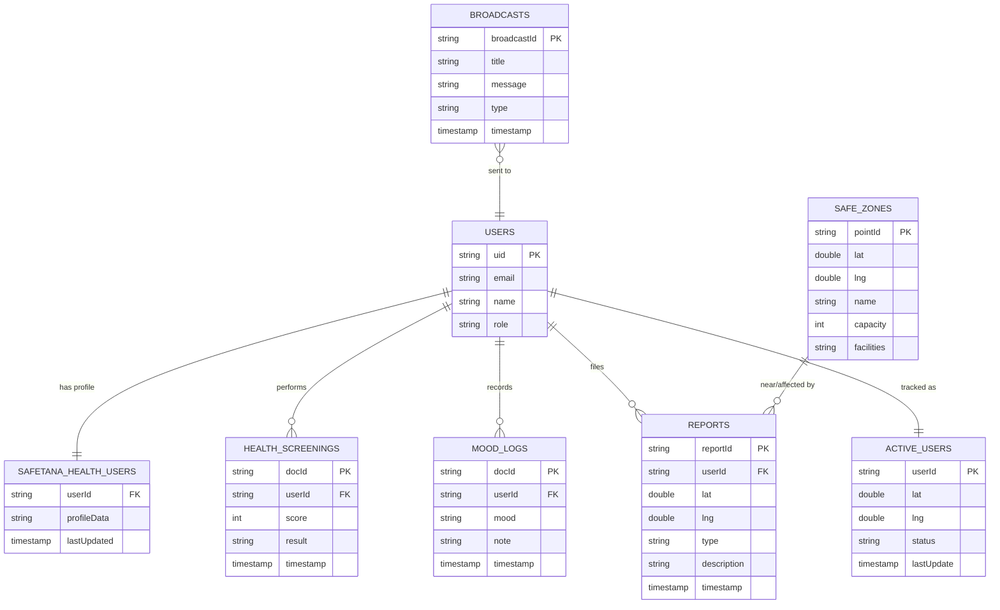
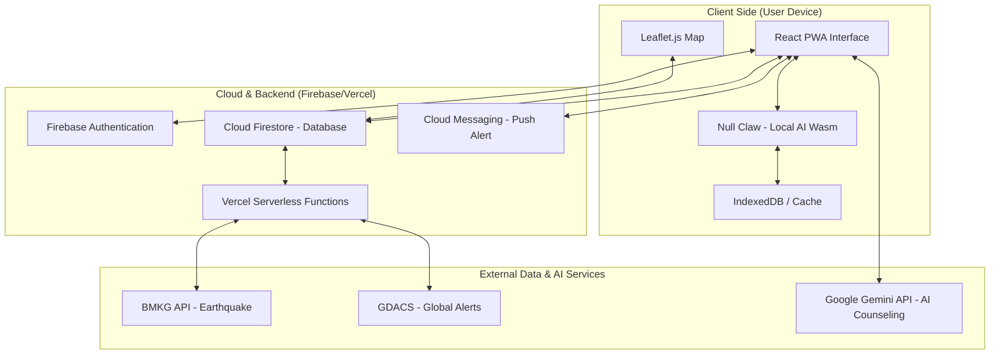
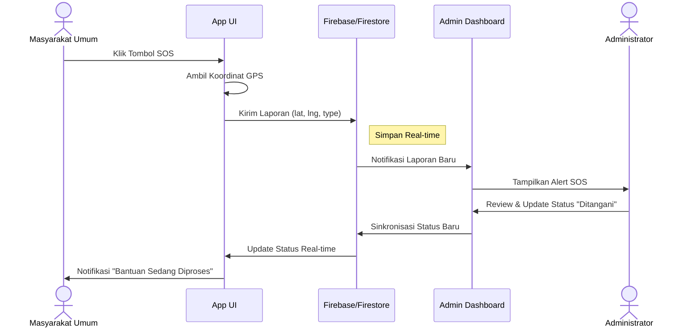
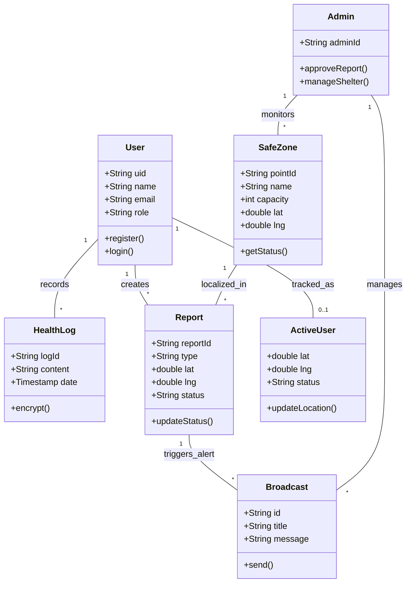

# Dokumen Perancangan Teknis - SafeTana

## 1. Pendahuluan

### 1.1 Tujuan Penulisan Dokumen
Dokumen ini disusun untuk memberikan spesifikasi teknis dan rancangan arsitektur aplikasi **SafeTana**. Dokumen ini digunakan oleh pengembang sebagai panduan implementasi, desainer sistem untuk pengembangan infrastruktur, dan pemangku kepentingan untuk memvalidasi alur bisnis serta integrasi data.

### 1.2 Lingkup Masalah
**SafeTana** adalah platform mitigasi bencana terintegrasi yang menggabungkan monitoring bencana real-time (BMKG/GDACS) dengan asisten kesehatan cerdas berbasis AI. Aplikasi ini dirancang untuk memberikan peringatan dini, panduan evakuasi ke shelter terdekat, serta bantuan medis mandiri saat akses kesehatan terbatas akibat bencana.

### 1.3 Definisi, Istilah dan Singkatan
*   **SafeTana**: Sistem Mitigasi Bencana Terintegrasi.
*   **PWA (Progressive Web App)**: Aplikasi web yang dapat diinstal dan memiliki kemampuan offline.
*   **Gemini AI**: Model bahasa besar (LLM) dari Google yang digunakan untuk asisten kesehatan.
*   **Null Claw Agent**: Modul AI lokal berbasis WebAssembly (Wasm) untuk mode offline.
*   **Firestore**: Database NoSQL berbasis cloud dari Firebase.
*   **PII Masking**: Teknik menyembunyikan informasi identitas pribadi untuk privasi.

### 1.4 Aturan Penomoran
*   **REQ-F-XXX**: Kebutuhan Fungsional.
*   **UC-XXX**: Kode Use Case.
*   **TBL-XXX**: Kode Tabel/Koleksi Data.

### 1.5 Referensi
*   Spesifikasi Kebutuhan Perangkat Lunak (SKPL) SafeTana.
*   Dokumentasi Firebase Cloud Firestore.
*   Google Gemini API Reference.

### 1.6 Deskripsi umum Dokumen (Ikhtisar)
Dokumen ini mencakup analisis proses bisnis (SIPOC), perancangan data model, arsitektur infrastruktur, pemodelan sistem menggunakan UML (Use Case, Activity, Sequence, Class), serta detail integrasi eksternal dan antarmuka pengguna.

---

## 2. SIPOC
Diagram SIPOC menggambarkan aliran data dan nilai dari sumber ke pengguna akhir.

| Supplier | Input | Process | Output | Customer |
| :--- | :--- | :--- | :--- | :--- |
| **BMKG / GDACS** | Data Gempa & Cuaca | Penarikan data (Fetch) & Analisis Radius | Notifikasi Peringatan Dini | Masyarakat Umum |
| **Google Gemini API** | Prompt Kesehatan User | Pemrosesan LLM & Konseling | Rekomendasi Medis/Psikologis | Masyarakat Umum |
| **User (Masyarakat)** | Koordinat SOS & Status | Enkripsi & Update Real-time | Laporan Darurat Lapangan | Administrator |
| **Administrator** | Data Titik Aman | Validasi & Manajemen Data | Peta Shelter Terverifikasi | Masyarakat Umum |

---

## 3. Perancangan Data

### 3.1 Daftar Koleksi (Firestore)
Aplikasi menggunakan database NoSQL Firestore dengan daftar koleksi utama sebagai berikut:

| Nama Koleksi | Primary Key | Deskripsi |
| :--- | :--- | :--- |
| `safe_points` | `pointId` | Menyimpan data titik evakuasi, kapasitas, dan fasilitas. |
| `reports` | `reportId` | Menyimpan laporan SOS dan kejadian dari masyarakat. |
| `broadcasts` | `broadcastId` | Menyimpan pesan peringatan dini dari Admin/Sistem. |
| `mood_logs` | `docId` | Riwayat kondisi psikologis dan jurnal kesehatan pengguna. |

### 3.2 Conceptual Data Model
### 3.2 Conceptual Entity Relationship Diagram (ERD)

#### Visualisasi Alur ERD (Chen Notation)


#### Struktur Relasi (Mermaid)
Berikut adalah diagram relasi antar entitas pada database Firestore SafeTana:


### 3.3 Struktur Tabel Database (Firestore Collections)

Berikut adalah detail struktur data untuk setiap koleksi yang digunakan dalam aplikasi SafeTana:

#### 1. Koleksi: `users` (Auth & Profile)
| No | Field Name | Data Type | Description |
| :--- | :--- | :--- | :--- |
| 1 | `uid` | String | ID unik dari Firebase Authentication (Primary Key). |
| 2 | `email` | String | Alamat email terdaftar pengguna. |
| 3 | `name` | String | Nama lengkap atau display name pengguna. |
| 4 | `role` | String | Peran pengguna (user atau admin). |
| 5 | `createdAt` | Timestamp | Waktu pendaftaran akun. |

#### 2. Koleksi: `safe_zones` (Data Titik Aman)
| No | Field Name | Data Type | Description |
| :--- | :--- | :--- | :--- |
| 1 | `pointId` | String | ID unik dokumen titik aman (Primary Key). |
| 2 | `name` | String | Nama tempat atau lokasi shelter (Contoh: GOR Saparua). |
| 3 | `lat` | Number | Koordinat Lintang (Latitude) lokasi. |
| 4 | `lng` | Number | Koordinat Bujur (Longitude) lokasi. |
| 5 | `capacity` | Number | Kapasitas maksimal penampungan (orang). |
| 6 | `facilities` | String | Daftar fasilitas tersedia (Medis, Logistik, Sanitasi). |

#### 3. Koleksi: `reports` (Laporan SOS & Kejadian)
| No | Field Name | Data Type | Description |
| :--- | :--- | :--- | :--- |
| 1 | `reportId` | String | ID unik dokumen laporan (Primary Key). |
| 2 | `userId` | String | ID pengguna yang melapor (Foreign Key). |
| 3 | `type` | String | Tipe kejadian (Gempa, Banjir, SOS, Kebakaran). |
| 4 | `lat` | Number | Lokasi Lintang pelapor saat mengirim. |
| 5 | `lng` | Number | Lokasi Bujur pelapor saat mengirim. |
| 6 | `description`| String | Penjelasan tambahan mengenai kondisi darurat. |
| 7 | `timestamp` | Timestamp | Waktu laporan dikirimkan. |

#### 4. Koleksi: `health_screenings` (Hasil Skrining AI)
| No | Field Name | Data Type | Description |
| :--- | :--- | :--- | :--- |
| 1 | `docId` | String | ID unik hasil skrining (Primary Key). |
| 2 | `userId` | String | ID pengguna yang melakukan skrining (Foreign Key). |
| 3 | `score` | Number | Skor hasil evaluasi kesehatan (Resiliensi/Stres). |
| 4 | `result` | String | Kesimpulan atau saran dari AI (Gemini). |
| 5 | `timestamp` | Timestamp | Waktu pemeriksaan dilakukan. |

#### 5. Koleksi: `mood_logs` (Jurnal Kesehatan Mental)
| No | Field Name | Data Type | Description |
| :--- | :--- | :--- | :--- |
| 1 | `docId` | String | ID unik catatan mood (Primary Key). |
| 2 | `userId` | String | ID pemilik catatan (Foreign Key). |
| 3 | `mood` | String | Status emosi (Senang, Cemas, Sedih, Tenang). |
| 4 | `note` | String | Catatan pribadi atau jurnal harian user. |
| 5 | `timestamp` | Timestamp | Waktu pencatatan mood. |

#### 6. Koleksi: `active_users` (Live Tracker)
| No | Field Name | Data Type | Description |
| :--- | :--- | :--- | :--- |
| 1 | `userId` | String | ID unik pengguna aktif (Primary Key). |
| 2 | `lat` | Number | Posisi Lintang terakhir pengguna. |
| 3 | `lng` | Number | Posisi Bujur terakhir pengguna. |
| 4 | `status` | String | Status keamanan (Safe, Danger, Evacuating). |
| 5 | `lastUpdate` | Timestamp | Waktu pembaruan lokasi terakhir. |

#### 7. Koleksi: `broadcasts` (Pesan Peringatan)
| No | Field Name | Data Type | Description |
| :--- | :--- | :--- | :--- |
| 1 | `broadcastId`| String | ID unik pesan peringatan (Primary Key). |
| 2 | `title` | String | Judul peringatan (Contoh: Waspada Tsunami). |
| 3 | `message` | String | Isi pesan atau instruksi darurat. |
| 4 | `type` | String | Kategori peringatan (Informasi, Peringatan, Bahaya). |
| 5 | `timestamp` | Timestamp | Waktu pesan dikirimkan oleh Admin. |

---

## 4. Arsitektur Sistem

### 4.1 Arsitektur Aplikasi
Aplikasi dibangun menggunakan arsitektur **PWA-Serverless** dengan pembagian layer sebagai berikut:



### 4.2 Arsitektur Integrasi
SafeTana mengintegrasikan beberapa layanan pihak ketiga:
- **BMKG API**: Untuk sinkronisasi data gempa bumi (JSON/XML).
- **GDACS**: Untuk notifikasi bencana global.
- **Google Gemini API**: Untuk pemrosesan bahasa alami pada fitur Klinik AI.

### 4.3 Arsitektur Infrastruktur
- **Hosting**: Firebase Hosting (Global CDN).
- **Functions**: Vercel Serverless Functions untuk sinkronisasi data berkala.
- **Storage**: Cloud Firestore (Database) & IndexedDB (Cache Offline).

---

## 5. Pemodelan Aplikasi

### 5.1 Use Case
*(Diagram Use Case telah disediakan pada dokumen sebelumnya)*

### 5.1 Deskripsi Use Case Keseluruhan

#### 1. Monitoring Peta Bencana
| Komponen | Deskripsi |
| :--- | :--- |
| **Fungsi Bisnis** | Mitigasi & Kewaspadaan Dini |
| **Use Case** | UC-01: Monitoring Peta Bencana |
| **Deskripsi** | Sistem menampilkan visualisasi titik bencana (gempa, cuaca) secara real-time dari sumber otoritas. |
| **Aktor** | Masyarakat Umum, Administrator |
| **Basic Flow** | 1. User membuka aplikasi. 2. Sistem menarik data dari BMKG/GDACS. 3. Sistem memplot koordinat pada peta Leaflet. 4. User melihat detail magnitudo/intensitas. |
| **Alternate Flow** | Jika API BMKG gagal, sistem menampilkan data terakhir yang tersimpan di cache (IndexedDB). |
| **Pre-Condition** | Perangkat memiliki koneksi internet (atau data cache tersedia). |
| **Post-Condition** | User mendapatkan informasi lokasi bencana terkini. |
| **Trigger/Events** | Aplikasi dibuka atau notifikasi peringatan dini masuk. |

#### 2. Cari Shelter & Rute Evakuasi
| Komponen | Deskripsi |
| :--- | :--- |
| **Fungsi Bisnis** | Penyelamatan & Evakuasi |
| **Use Case** | UC-02: Cari Shelter & Rute Evakuasi |
| **Deskripsi** | Menemukan titik aman terdekat dan memberikan panduan rute navigasi. |
| **Aktor** | Masyarakat Umum |
| **Basic Flow** | 1. User memilih fitur "Safe Zone". 2. Sistem mendeteksi lokasi GPS user. 3. Sistem membandingkan koordinat user dengan database `safe_points`. 4. Sistem menampilkan rute tercepat. |
| **Alternate Flow** | Jika GPS tidak aktif, user diminta memasukkan lokasi secara manual atau memilih titik di peta. |
| **Pre-Condition** | Fitur Geolocation pada browser diaktifkan. |
| **Post-Condition** | Tampil rute navigasi ke titik aman di layar user. |
| **Trigger/Events** | User menekan tombol "Find Safe Zone". |

#### 3. Konsultasi Klinik AI
| Komponen | Deskripsi |
| :--- | :--- |
| **Fungsi Bisnis** | Layanan Kesehatan Mandiri |
| **Use Case** | UC-03: Konsultasi Klinik AI |
| **Deskripsi** | Chatbot berbasis AI untuk bantuan medis pertama dan konseling psikologis darurat. |
| **Aktor** | Masyarakat Umum |
| **Basic Flow** | 1. User membuka modul Klinik AI. 2. User memasukkan keluhan/gejala. 3. Sistem mengirimkan ke Gemini API. 4. AI memberikan respon panduan medis. |
| **Alternate Flow** | Jika offline, sistem menggunakan Null Claw (Local AI) dengan dataset `kamusData.json`. |
| **Pre-Condition** | User telah login untuk sinkronisasi jurnal kesehatan. |
| **Post-Condition** | User mendapatkan panduan tindakan medis pertama. |
| **Trigger/Events** | User mengirim pesan di kolom chat Klinik AI. |

#### 4. Lapor Status SOS
| Komponen | Deskripsi |
| :--- | :--- |
| **Fungsi Bisnis** | Pelaporan Darurat |
| **Use Case** | UC-04: Lapor Status SOS |
| **Deskripsi** | Melaporkan kondisi darurat dan lokasi terkini ke pusat komando (Admin). |
| **Aktor** | Masyarakat Umum |
| **Basic Flow** | 1. User menekan tombol "SOS". 2. Sistem mengambil koordinat GPS terkini. 3. Sistem mengirim data laporan ke koleksi `reports` di Firestore. 4. Notifikasi dikirim ke Admin. |
| **Alternate Flow** | User dapat menambahkan deskripsi tambahan atau foto kejadian sebelum mengirim. |
| **Pre-Condition** | User dalam radius area bencana atau kondisi darurat. |
| **Post-Condition** | Laporan tersimpan di database dan terlihat oleh Admin secara real-time. |
| **Trigger/Events** | Tombol SOS ditekan. |

#### 5. Manajemen Data Shelter (Admin)
| Komponen | Deskripsi |
| :--- | :--- |
| **Fungsi Bisnis** | Tata Kelola Data Lapangan |
| **Use Case** | UC-05: Manajemen Data Shelter |
| **Deskripsi** | Mengelola (Tambah, Ubah, Hapus) informasi titik aman/shelter. |
| **Aktor** | Administrator |
| **Basic Flow** | 1. Admin login ke CommandCenter. 2. Pilih menu "Safe Zone Manager". 3. Admin input data (Nama, Kapasitas, Koordinat). 4. Sistem update koleksi `safe_points`. |
| **Alternate Flow** | Admin dapat mengubah status shelter menjadi "Penuh" untuk mengalihkan rute user. |
| **Pre-Condition** | Memiliki hak akses Administrator. |
| **Post-Condition** | Data shelter terbaru dipublikasikan ke peta seluruh user. |
| **Trigger/Events** | Perubahan kondisi di lapangan atau penambahan shelter baru. |

#### 6. Monitor Laporan SOS (Admin)
| Komponen | Deskripsi |
| :--- | :--- |
| **Fungsi Bisnis** | Respon Darurat & Monitoring |
| **Use Case** | UC-06: Monitor Laporan SOS |
| **Deskripsi** | Memantau seluruh laporan masuk dari masyarakat untuk koordinasi bantuan. |
| **Aktor** | Administrator |
| **Basic Flow** | 1. Admin membuka dashboard Monitor. 2. Sistem menampilkan daftar laporan terbaru dari koleksi `reports`. 3. Admin melakukan verifikasi status laporan (Pending/Handled). |
| **Alternate Flow** | Admin memfilter laporan berdasarkan radius lokasi atau tipe bencana. |
| **Pre-Condition** | Admin aktif dalam sesi login. |
| **Post-Condition** | Laporan diproses dan status bantuan terupdate. |
| **Trigger/Events** | Laporan baru masuk ke sistem Firestore. |

### 5.2 Activity Diagram (Keseluruhan Flow Aplikasi)

#### Visualisasi Alur Aktivitas (Swimlanes)


#### Alur Proses Bisnis (Mermaid)
Berikut adalah gambaran mengenai proses-proses yang terjadi pada sistem:
    :User menerima notifikasi bencana;
    :Buka dashboard peta;
    :Klik "Cari Shelter Terdekat";
    if (Lokasi GPS aktif?) then (Ya)
        :Hitung rute via Haversine;
        :Tampilkan navigasi peta;
    else (Tidak)
        :Minta izin lokasi;
        stop
    endif
    :Sampai di titik aman;
    :Update status "Safe";
    stop
```

### 5.3 Sequence Diagram (Pelaporan SOS & Respon)

#### Visualisasi Alur Pesan (Sequence Diagram)


#### Interaksi Objek (Mermaid)
Berikut menjelaskan interaksi antar objek-objek dalam sistem secara terperinci:



### 5.4 Class Diagram (Struktur Sistem)

#### Visualisasi Struktur Kelas (Class Diagram)


#### Cetak Biru Sistem (Mermaid)
Berikut menggambarkan dengan jelas struktur serta deskripsi class, atribut, metode, dan hubungan dari setiap objek:



---

## 6. Integrasi
Aplikasi melakukan interoperabilitas data dengan:
1.  **BMKG**: Data gempa bumi terkini ditarik setiap 5 menit untuk update dashboard.
2.  **GDACS**: Peringatan cuaca ekstrim dan banjir tingkat global.
3.  **Google Gemini API**: Integrasi via SDK untuk fitur chatbot kesehatan.
4.  **BNPB GIS Services (inaRISK & inaWARE)**: Menarik layer peta tematik bencana (banjir, gempa bumi, tanah longsor, dan survei risiko InAWARE) melalui ArcGIS REST Services.

---

## 7. User Interface (UI)

Daftar halaman antarmuka utama:
1.  **Dashboard Utama**: Ringkasan bencana terbaru dan status keamanan.
2.  **Peta Interaktif**: Visualisasi Leaflet dengan layer titik aman dan area bahaya.
3.  **Klinik AI Portal**: Antarmuka chat untuk bantuan medis mandiri.
4.  **Admin CommandCenter**: Dashboard khusus administrator untuk manajemen data dan monitoring SOS.
5.  **Education Hub**: Katalog konten edukasi bencana (artikel & video).
