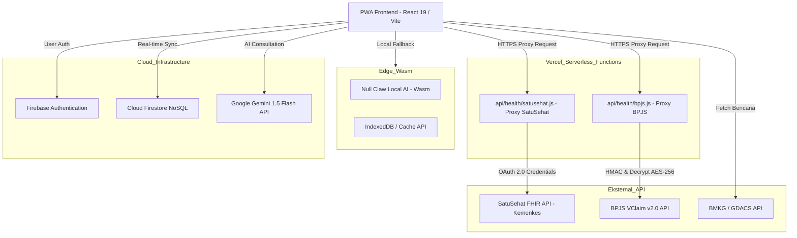
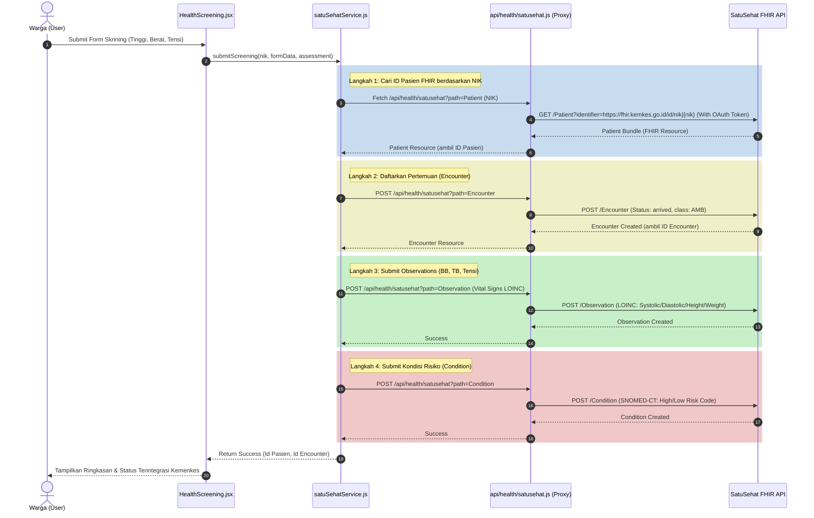
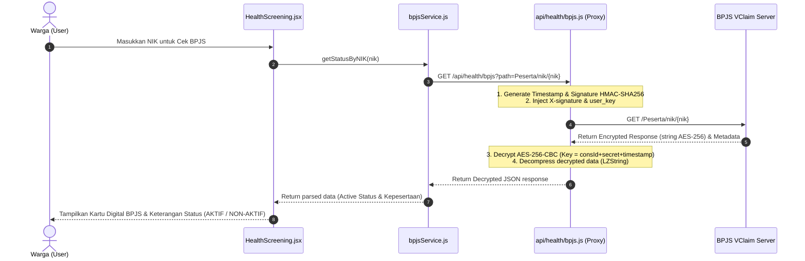

# Dokumen Perancangan Perangkat Lunak (SDD): SafeTana

## 1. Pendahuluan
### 1.1 Tujuan Penulisan Dokumen
Dokumen Perancangan Perangkat Lunak (SDD) ini disusun untuk memberikan spesifikasi teknis mendalam dan rancangan arsitektur aplikasi SafeTana. Dokumen ini digunakan oleh tim pengembang sebagai panduan implementasi kode, administrator sistem untuk pengembangan infrastruktur, serta pemangku kepentingan untuk memvalidasi seluruh alur integrasi data dan proses bisnis.

### 1.2 Lingkup Masalah
SafeTana adalah platform mitigasi bencana terintegrasi berbasis AI dan layanan kesehatan mandiri yang dirancang untuk meningkatkan ketahanan masyarakat dalam menghadapi krisis. Sistem ini menggabungkan pemantauan bencana secara *real-time* (BMKG/GDACS) dengan asisten kesehatan cerdas, pencarian titik aman evakuasi, serta direktori dan verifikasi layanan kesehatan nasional (SATUSEHAT & BPJS).

### 1.3 Definisi, Istilah dan Singkatan
*   **SafeTana:** Sistem Mitigasi Bencana Terintegrasi.
*   **PWA (Progressive Web App):** Aplikasi web modern dengan kapabilitas menyerupai aplikasi mobile native, termasuk instalasi lokal dan dukungan offline mode.
*   **Gemini AI:** Model bahasa besar (LLM) dari Google yang digunakan sebagai asisten kesehatan cerdas pada Klinik AI.
*   **Null Claw Agent:** Mesin AI lokal berbasis WebAssembly (Wasm) untuk pemrosesan teks medis secara lokal tanpa koneksi internet.
*   **N.O.M.A.D.:** Arsitektur infrastruktur *offline-first* untuk distribusi data bencana dan pengetahuan medis esensial secara lokal.
*   **SATUSEHAT:** Platform interoperabilitas data kesehatan nasional milik Kementerian Kesehatan RI berbasis standar HL7 FHIR R4.
*   **FHIR (Fast Healthcare Interoperability Resources):** Standar global pertukaran data kesehatan elektronik.
*   **BPJS Kesehatan VClaim:** Layanan verifikasi keanggotaan dan rujukan klaim dari BPJS Kesehatan menggunakan standar keamanan ketat (HMAC Signature, AES-256-CBC Decryption, dan LZ-String Decompression).
*   **Fasyankes:** Fasilitas Pelayanan Kesehatan (Puskesmas, Klinik, Rumah Sakit).
*   **PII Masking:** Teknik masking informasi sensitif pribadi (Nama, NIK, No. HP) untuk melindungi privasi data warga pada panel admin.
*   **Service Pattern:** Pola arsitektur kode untuk memisahkan logika bisnis integrasi API (bencana, AI, kesehatan) dari komponen antarmuka pengguna (UI).

### 1.4 Aturan Penomoran
*   **REQ-F-XXX:** Kode Kebutuhan Fungsional.
*   **UC-XXX:** Kode Use Case UML.
*   **TBL-XXX:** Kode Tabel / Koleksi Database Firestore.

### 1.5 Referensi
*   Spesifikasi Kebutuhan Perangkat Lunak (SRS) SafeTana.
*   Panduan Integrasi HL7 FHIR R4 Kementerian Kesehatan RI (SATUSEHAT Sandbox).
*   Panduan Teknis Integrasi API VClaim BPJS Kesehatan v2.0.
*   Dokumentasi API Google Gemini & Leaflet.js.
*   Undang-Undang Republik Indonesia Nomor 24 Tahun 2007 tentang Penanggulangan Bencana.

### 1.6 Deskripsi Umum Dokumen
Dokumen ini mencakup pemodelan proses bisnis (SIPOC), perancangan database NoSQL Firestore, arsitektur integrasi serverless proxy, pemodelan sistem menggunakan diagram UML (Use Case, Activity, Sequence, Class), spesifikasi antarmuka API eksternal, dan rancangan UI.

---

## 2. SIPOC (Supplier, Input, Process, Output, Customer)
Diagram SIPOC berikut memetakan aliran data masuk hingga bernilai guna bagi pengguna akhir:

| Supplier | Input | Process (Aplikasi) | Output | Customer |
| :--- | :--- | :--- | :--- | :--- |
| **BMKG / GDACS** | Data Gempa, Cuaca Ekstrim, & Banjir | Penarikan berkala (fetch per 5 mnt) & Analisis radius bahaya geospasial | Peringatan dini (*Push Alert*) & pemetaan bahaya | Masyarakat Umum |
| **Google Gemini API** | Keluhan kesehatan / prompt user | Pemrosesan LLM & Analisis sentimen triase | Rekomendasi medis awal & konseling psikologis | Masyarakat Umum |
| **SATUSEHAT FHIR API (Kemenkes)** | NIK Pasien / ID Fasyankes | Integrasi FHIR R4 (Pencarian NIK, submit Encounter, Observation, Condition) | Profil Pasien terverifikasi, direktori fasyankes, & log skrining terintegrasi | Masyarakat, Dokter, Faskes |
| **BPJS Kesehatan API** | Nomor NIK | Pembuatan HMAC SHA-256, request VClaim proxy, Decrypt AES-256, Decompress LZ-String | Status keaktifan kepesertaan BPJS | Pengguna Mandiri, Operator |
| **User (Masyarakat)** | Koordinat GPS & Status Bahaya | Enkripsi koordinat (Crypto-JS) & Sinkronisasi Real-time | Laporan SOS darurat di peta Command Center | Admin / Otoritas Bencana |
| **Administrator** | Data Titik Aman / Shelter | Input data kapasitas, koordinat, dan kelayakan fasilitas | Peta titik evakuasi tervalidasi dan rute aman | Masyarakat Umum |

---

## 3. Perancangan Data
### 3.1 Daftar Koleksi (Firestore DB)
Database NoSQL Firestore dirancang dengan koleksi terstruktur sebagai berikut:

| Nama Koleksi | Primary Key | Deskripsi |
| :--- | :--- | :--- |
| **`users`** | `uid` | Data profil dasar pengguna (terintegrasi dengan Firebase Auth). |
| **`safe_zones`** | `pointId` | Daftar koordinat titik evakuasi, kapasitas, dan ketersediaan logistik. |
| **`reports`** | `reportId` | Laporan darurat / SOS yang dikirimkan warga di lapangan (Enkrypted). |
| **`health_screenings`** | `docId` | Log riwayat skrining kesehatan fisik yang disinkronkan ke SATUSEHAT. |
| **`mood_logs`** | `docId` | Catatan harian emosi dan jurnal kesehatan mental (konseling AI). |
| **`active_users`** | `userId` | Tracking lokasi real-time dari pengguna aktif dalam area bencana. |
| **`broadcasts`** | `broadcastId`| Riwayat push notification peringatan dini dari Admin/Sistem. |

### 3.2 Struktur Data Detil
#### 1. Koleksi: `users`
*   `uid` (String, PK): ID unik dari Firebase Authentication.
*   `email` (String): Alamat email terdaftar.
*   `name` (String): Nama lengkap pengguna (mengalami PII Masking di dashboard admin).
*   `role` (String): Peran pengguna (`user`, `admin`, `operator`).
*   `nik` (String): NIK terenkripsi (opsional untuk integrasi BPJS/SATUSEHAT).

#### 2. Koleksi: `safe_zones`
*   `pointId` (String, PK): ID unik titik evakuasi.
*   `name` (String): Nama lokasi penampungan (contoh: "GOR Saparua").
*   `lat` (Number): Koordinat Lintang (Latitude).
*   `lng` (Number): Koordinat Bujur (Longitude).
*   `capacity` (Number): Kapasitas maksimal penampungan (orang).
*   `current_occupancy` (Number): Jumlah pengungsi saat ini.
*   `facilities` (String): Fasilitas tersedia (contoh: "Medis, Logistik, Sanitasi").

#### 3. Koleksi: `health_screenings` (SATUSEHAT Sync Log)
*   `docId` (String, PK): ID unik log skrining.
*   `userId` (String, FK): Referensi ke pengguna.
*   `tb` (Number): Tinggi badan (cm).
*   `bb` (Number): Berat badan (kg).
*   `sistolik` (Number): Tekanan darah sistolik (mmHg).
*   `diastolik` (Number): Tekanan darah diastolik (mmHg).
*   `riskLevel` (String): Tingkat risiko hasil penilaian (`Rendah`, `Sedang`, `Tinggi`).
*   `encounterId` (String): ID rujukan transaksi di SATUSEHAT Sandbox.
*   `patientId` (String): ID pasien FHIR di Kemenkes.
*   `timestamp` (Timestamp): Waktu pemeriksaan.

#### 4. Dataset Statis / Fallback: `mockFasyankesJabar` (Local Directory JSON)
Digunakan sebagai fallback lokal saat API Master Sarana SATUSEHAT tidak stabil:
*   `kode_satusehat` (String, Key): ID Fasyankes nasional.
*   `nama` (String): Nama Fasyankes (contoh: "RSUP Dr. Hasan Sadikin").
*   `jenis_sarana` (Object): `{ id: "104", nama: "Rumah Sakit" }` (104=RS, 103=Klinik, 102=Puskesmas, 101=Praktik Mandiri).
*   `alamat` (String): Alamat lengkap faskes.
*   `latitude` (Number): Koordinat Lintang faskes.
*   `longitude` (Number): Koordinat Bujur faskes.
*   `kabkota` (Object): `{ id: "3273", nama: "KOTA BANDUNG" }`.
*   `status_aktif` (Boolean): Status operasional faskes.

---

## 4. Arsitektur Sistem
SafeTana dibangun dengan arsitektur **Hybrid Serverless-Edge** untuk menjamin kecepatan respons, ketersediaan tinggi, dan keamanan data:



### 4.1 Serverless Proxy Layer (Vercel Functions)
Untuk mematuhi standar keamanan API kesehatan nasional tanpa mengekspos *credential key* pada client, diimplementasikan Proxy Backend:
1.  **BPJS Proxy (`api/health/bpjs.js`):**
    *   **Signature Generator:** Membuat signature HMAC-SHA256 dari `CONS_ID` + `SECRET_KEY` + `timestamp` saat runtime.
    *   **AES-256-CBC Decryptor:** BPJS mengirimkan data yang terenkripsi. Proxy melakukan dekripsi menggunakan kunci hash SHA-256 dari gabungan `CONS_ID` + `SECRET_KEY` + `timestamp`.
    *   **LZ-String Decompressor:** proxy mengompresi balik data hasil dekripsi sebelum dikirimkan ke frontend menggunakan algoritma LZ-String.
2.  **SATUSEHAT Proxy (`api/health/satusehat.js`):**
    *   Mengotomatisasi perolehan OAuth 2.0 Client Credentials token menggunakan `CLIENT_ID` dan `CLIENT_SECRET` Kemenkes.
    *   Melakukan manajemen injeksi Bearer Token pada setiap *request proxy* FHIR (Patient, Encounter, Observation, Condition).

---

## 5. Pemodelan Aplikasi
### 5.1 Use Case Diagram
Sistem memiliki 3 aktor utama: Warga (Masyarakat Umum), Operator Lapangan, dan Administrator (Pusat Komando).

```mermaid
left_to_right_direction
actor Warga as "Warga / Pasien"
actor Admin as "Administrator"
actor Operator as "Operator Lapangan"

rectangle SafeTana_System {
    usecase "Login & Registrasi" as UC01
    usecase "Monitoring Peta Bencana" as UC02
    usecase "Cari Titik Aman & Rute" as UC03
    usecase "Lapor SOS Darurat" as UC04
    usecase "Konsultasi Klinik AI" as UC05
    usecase "Cek Keaktifan BPJS" as UC06
    usecase "Skrining & Sinkronisasi SATUSEHAT" as UC07
    usecase "Manajemen Titik Evakuasi" as UC08
    usecase "Monitor SOS & Koordinasi" as UC09
}

Warga --> UC01
Warga --> UC02
Warga --> UC03
Warga --> UC04
Warga --> UC05
Warga --> UC06
Warga --> UC07

Operator --> UC01
Operator --> UC08

Admin --> UC01
Admin --> UC02
Admin --> UC08
Admin --> UC09

UC03 .> UC02 : <<extend>>
UC07 .> UC05 : <<include>>
```

### 5.2 Sequence Diagram
#### 1. Skrining Kesehatan & Sinkronisasi SATUSEHAT (HL7 FHIR R4 Standard)
Proses pencatatan data kesehatan vital signs dari Klinik AI ke server Kemenkes:



#### 2. Verifikasi Kepesertaan BPJS (AES Decrypt & LZ Decompress)
Alur verifikasi keanggotaan BPJS Kesehatan VClaim v2.0 yang aman melalui backend proxy:



---

## 6. Antarmuka Pemrograman Aplikasi (API Integrasi)
### 6.1 Integrasi API BPJS Kesehatan (VClaim v2.0)
*   **Method:** `GET`
*   **Client Call Endpoint:** `/api/health/bpjs?path=Peserta/nik/{nik}/tglRencanaKontrol/{today}`
*   **Header Pengenal Proxy (Internal backend):**
    *   `X-cons-id`: `{BPJS_CONS_ID}`
    *   `X-timestamp`: Unix Epoch timestamp (detik).
    *   `X-signature`: Base64 HMAC-SHA256 signature.
    *   `user_key`: `{BPJS_USER_KEY}`
*   **Response Payload (Hasil Dekripsi Proxy):**
    ```json
    {
      "metaData": {
        "code": "200",
        "message": "OK"
      },
      "response": {
        "peserta": {
          "nik": "327301XXXXXXXXXX",
          "nama": "BUDI SANTOSO",
          "sex": "L",
          "statusPeserta": {
            "kode": "0",
            "keterangan": "AKTIF"
          },
          "jenisPeserta": {
            "keterangan": "PBI (PENERIMA BANTUAN IURAN)"
          }
        }
      }
    }
    ```

### 6.2 Integrasi API SATUSEHAT FHIR R4 (Kemenkes)
*   **Method:** `GET / POST`
*   **Client Call Endpoint:** `/api/health/satusehat?path={FHIR_Resource_Path}`
*   **Standard Interoperabilitas:** HL7 FHIR R4.
*   **Contoh payload pendaftaran pertemuan (`Encounter` POST):**
    ```json
    {
      "resourceType": "Encounter",
      "status": "arrived",
      "class": {
        "system": "http://terminology.hl7.org/CodeSystem/v3-ActCode",
        "code": "AMB",
        "display": "ambulatory"
      },
      "subject": {
        "reference": "Patient/P02035971169",
        "display": "BUDI SANTOSO"
      },
      "serviceProvider": {
        "reference": "Organization/10000004"
      }
    }
    ```

---

## 7. Desain Antarmuka Pengguna (UI)
Antarmuka didesain menggunakan pendekatan **True Black Dark Mode** dan **Glassmorphism** untuk kenyamanan mata pengguna di tengah kepanikan darurat bencana:

1.  **Dashboard Utama:** Berisi peta interaktif bencana (Leaflet.js), kompas rute, tombol cepat SOS, dan menu akses cepat Klinik AI.
2.  **Direktori Fasyankes (SATUSEHAT & Mock Fallback):** Menampilkan sebaran rumah sakit, puskesmas, dan klinik terdekat dari lokasi pengguna. Dilengkapi status operasional (Aktif/Tutup) dan integrasi navigasi langsung.
3.  **Portal Klinik AI & Skrining:** Antarmuka interaktif yang menggabungkan *chatbot* konsultasi medis (Gemini/Null Claw) dengan tab skrining data vital (berat badan, tensi) untuk sinkronisasi otomatis ke akun SATUSEHAT warga.
4.  **Admin Command Center:** Dashboard monitoring *real-time* sebaran warga terdampak (SOS tracker), heatmap bahaya, dan managemen titik evakuasi yang aman secara dinamis.

*Tautan desain prototipe digital dapat diakses di: [Figma SafeTana](https://www.figma.com/design/DzauWoVoJK0SSqoiZQJXQL/SafeTana?node-id=0-1&t=SXX3cZhAdrQzdUPn-1)*

---

### Catatan Penyelarasan Tim Pengembang:
> [!IMPORTANT]
> Seluruh layanan integrasi kesehatan eksternal wajib melalui Serverless Proxy (`/api/health/*`) demi alasan keamanan data pribadi pasien dan perlindungan credential keys. Penggunaan database di sisi client dalam kondisi offline wajib memanfaatkan sinkronisasi state lokal `NullClawBridge` dan cache storage `IndexedDB`.
